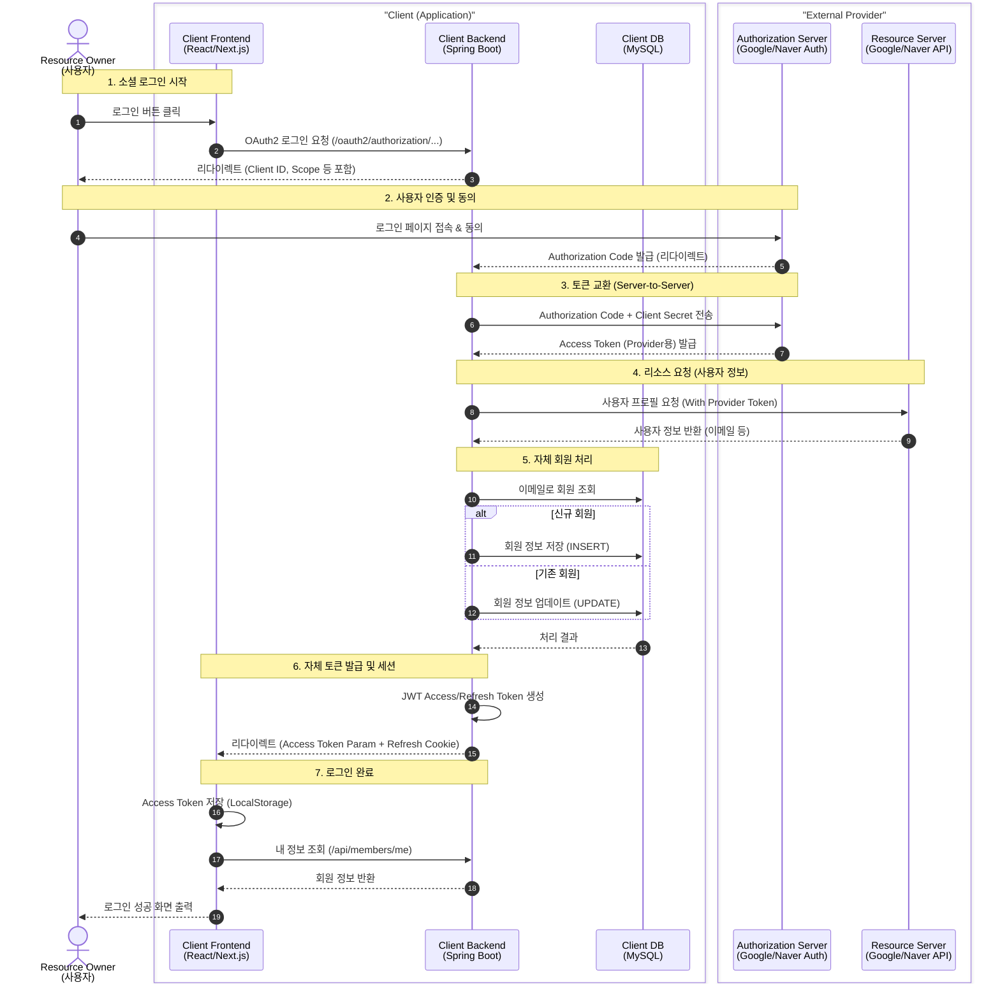

```mermaid
sequenceDiagram
    autonumber
    actor RO as Resource Owner<br/>(사용자)
    box "Client (Application)" #f9f9f9
        participant Front as Client Frontend<br/>(React/Next.js)
        participant Back as Client Backend<br/>(Spring Boot)
        participant DB as Client DB<br/>(MySQL)
    end
    box "External Provider" #eaeaea
        participant AS as Authorization Server<br/>(Google/Naver Auth)
        participant RS as Resource Server<br/>(Google/Naver API)
    end

    Note over RO, Front: 1. 소셜 로그인 시작
    RO->>Front: 로그인 버튼 클릭
    Front->>Back: OAuth2 로그인 요청 (/oauth2/authorization/...)
    Back-->>RO: 리다이렉트 (Client ID, Scope 등 포함)
    
    Note over RO, AS: 2. 사용자 인증 및 동의
    RO->>AS: 로그인 페이지 접속 & 동의
    AS-->>Back: Authorization Code 발급 (리다이렉트)

    Note over Back, AS: 3. 토큰 교환 (Server-to-Server)
    Back->>AS: Authorization Code + Client Secret 전송
    AS-->>Back: Access Token (Provider용) 발급

    Note over Back, RS: 4. 리소스 요청 (사용자 정보)
    Back->>RS: 사용자 프로필 요청 (With Provider Token)
    RS-->>Back: 사용자 정보 반환 (이메일 등)

    Note over Back, DB: 5. 자체 회원 처리
    Back->>DB: 이메일로 회원 조회
    alt 신규 회원
        Back->>DB: 회원 정보 저장 (INSERT)
    else 기존 회원
        Back->>DB: 회원 정보 업데이트 (UPDATE)
    end
    DB-->>Back: 처리 결과

    Note over Back, Front: 6. 자체 토큰 발급 및 세션
    Back->>Back: JWT Access/Refresh Token 생성
    Back-->>Front: 리다이렉트 (Access Token Param + Refresh Cookie)
    
    Note over Front, Back: 7. 로그인 완료
    Front->>Front: Access Token 저장 (LocalStorage)
    Front->>Back: 내 정보 조회 (/api/members/me)
    Back-->>Front: 회원 정보 반환
    Front-->>RO: 로그인 성공 화면 출력
```
